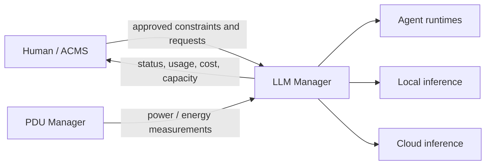

# LLM Manager

LLM Manager is Startup Teams' infrastructure control plane for AI-agent runtimes and inference resources. It exists to make model-serving capacity, runtime placement, health, configuration history, benchmarks, recovery, usage, and cost understandable and controllable without forcing higher-level orchestration systems to manage GPUs, vLLM processes, model servers, or provider routing directly.

The service is a supporting infrastructure service for the AgentifyMe Cloud Management System (ACMS). **ACMS decides what work should happen and under what human-approved constraints; LLM Manager decides how approved inference needs are satisfied operationally and reports the resulting status, usage, performance, and cost.**

## Business reasons

Startup Teams operates a heterogeneous mix of local GPU servers, CPU/unified-memory systems, patched model runtimes, and cloud inference providers. Without a dedicated control plane, each agent or operator would need to know host-specific commands, model artifacts, parallelism, recovery behavior, costs, and rollback procedures. That creates unnecessary operational risk and makes it difficult to compare or reproduce model configurations.

LLM Manager is intended to provide:

- a stable abstraction over local and cloud inference endpoints;
- repeatable, auditable model and runtime configuration;
- safe recovery and rollback from failed model changes;
- benchmark history tied to the exact deployment that produced it;
- enough capacity and health information to schedule agent inference intelligently;
- raw usage and cost data for ACMS and humans;
- an integration boundary that lets ACMS orchestrate agents without owning low-level inference infrastructure;
- a path from today's MARION-IA-USA environment to future remote, cloud, customer-owned, and additional Startup Teams execution locations.

## Repository source of truth

| File | Purpose |
|---|---|
| `REQUIREMENTS.md` | Approved LLM Manager product scope and acceptance criteria. |
| `FUTURE_WORK.md` | Deferred, unapproved, or intentionally unresolved work. |
| `SPRINT.md` | Current implementation/capture sprint. |
| `docs/ARCHITECTURE.md` | Architecture intent and system boundaries. |
| `docs/BUSINESS_CONTEXT.md` | Business motivation, users, and operating principles. |
| `docs/OPERATIONS_AND_USAGE.md` | How humans and agents should use the current service safely. |
| `docs/IMPLEMENTATION_STATUS.md` | What is implemented, partial, unimplemented, and limited today. |
| `docs/DEVELOPER_SETUP.md` | Developer/build/setup commands and the repo-to-deployment map. |
| `service/` | Captured deployed source (2026-09-25): `app/` web shell + core + recovery, `collectors/`, `control/` allowlisted PVE shim. |
| `ops/` | Captured sanitized operations configs: systemd units, nginx site, LiteLLM config/env names. |
| `config/examples/` | Requirements freeze from the deployed venv (reproducibility reference). |
| `db/schema/schema.sql` | Schema-only database reference (no row data). |
| `docs/ACMS_INTEGRATION.md` | Intended ACMS <-> LLM Manager boundary and future interface. |
| `docs/MODEL_SERVING_AND_BENCHMARKING.md` | Model-serving, benchmarking, history, and rollback intent. |
| `docs/adr/` | Human-visible significant architecture decisions. |
| `docs/tdr/` | Known intentionally carried technical debt. |
| `AGENTS.md` | Guardrails for AI agents modifying the service. |
| `docs/AGENT_READINESS.md` | Agent-readiness checklist for this product. |

## Core workflow

## Scope flow

Unapproved ideas belong in `FUTURE_WORK.md`. Approved capabilities belong in `REQUIREMENTS.md`. Significant human decisions are recorded as ADRs. Known accepted shortcuts and operational limitations are recorded as TDRs.

Agents must not silently promote future work into requirements or merge architecture decisions without human review.

## Current deployment context

The first deployment is MARION-IA-USA. The service currently coordinates a heterogeneous environment that has included:

- local vLLM model servers on GPU VMs;
- llama.cpp on CPU/unified-memory systems;
- LiteLLM/OpenAI-compatible routing;
- cloud models through external providers;
- Proxmox-managed VMs;
- model configuration presets, deployment history, and benchmark records;
- recovery logic that can control desired service and desired VM power state.

Model assignments are operational state and change frequently. **Do not treat this README as the live model registry. Query LLM Manager and the infrastructure before making changes.**

## Human review and Git workflow

- Work in a dedicated branch; do not commit directly to `main`.
- Use the Startup Teams Conventional Commit format: `type(scope): short description (#issue-id)`.
- Branch format: `type/ticket-short-description`.
- Run documented validation before requesting review.
- Surface requirement changes, ADRs, TDRs, security-sensitive changes, failed checks, and unresolved risks in the PR.
- A human reviewer approves before merge under the current operating model.
