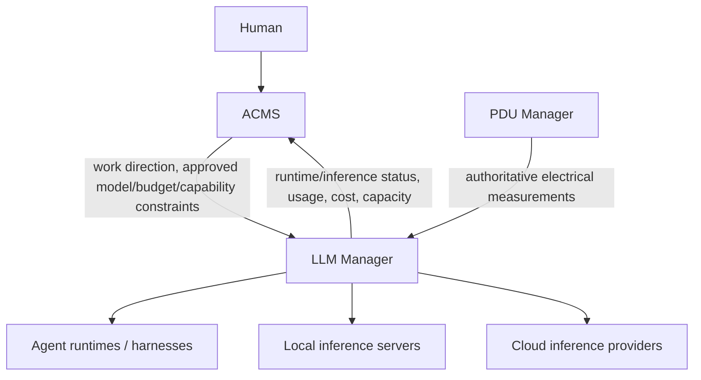

# ACMS Integration Direction

## Boundary

ACMS is authoritative for persistent agent orchestration, work, project/context governance, human interaction, approvals, and progress. LLM Manager is authoritative for runtime/inference infrastructure and raw inference cost/usage.

## Data LLM Manager should eventually expose

### Runtime identity/state

- LLM Manager runtime identifier.
- Harness/runtime type and version.
- Host/site.
- Configuration version/lock state.
- Running/stopped/busy/idle/health/degraded state where known.
- Last heartbeat/update.

### Inference state

- Current model and actual artifact/provider.
- Endpoint/provider and local/cloud classification.
- Context/capability limits.
- Availability/load/capacity indicators.

### Usage/cost

- Input/output tokens and requests where available.
- Inference duration/context utilization.
- Raw local electricity-related cost where attributable.
- Cloud/provider cost.
- Freshness and estimated/measured status.

## Control operations ACMS may eventually request

Subject to authorization and runtime capability:

- start/stop/restart;
- pause/resume/interrupt;
- steering/work submission;
- query health/state;
- query current model;
- authorized model/inference change.

## Not yet approved

The following remain future design work:

- exact API paths and schema;
- service-to-service authentication;
- canonical ACMS-agent-ID mapping;
- configuration locking semantics;
- which runtime controls are proxied through LLM Manager versus direct to harness adapters;
- budget/policy enforcement schema;
- cross-site discovery/routing;
- command authorization/audit model.

Do not invent these interfaces in production without human review.
