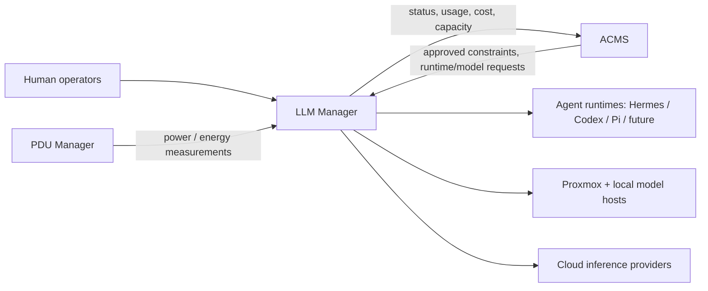
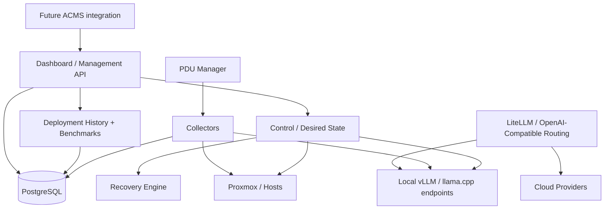
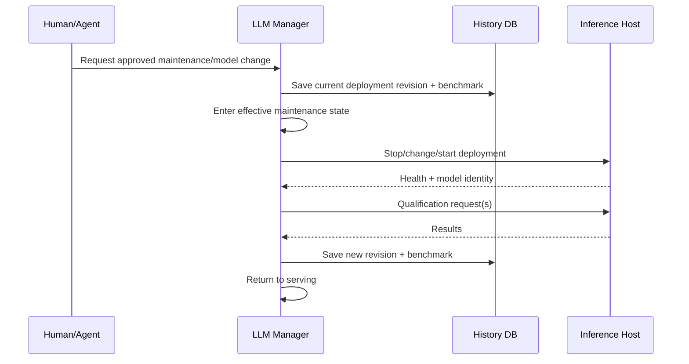
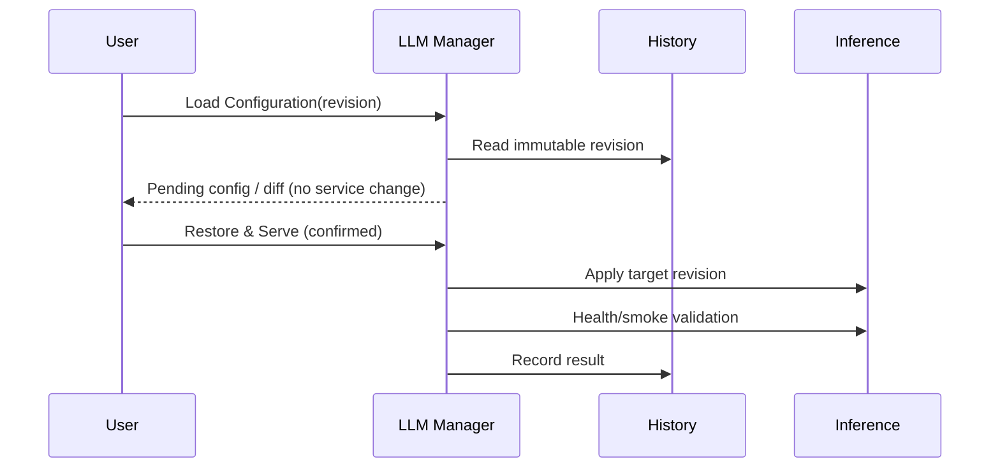
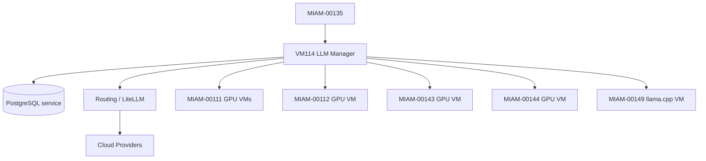

# LLM Manager Architecture

This document uses the 12-section arc42 structure with C4-inspired Mermaid views.

## 1. Introduction and Goals

LLM Manager is the Startup Teams infrastructure service responsible for AI-agent runtime/inference infrastructure. Its primary goals are:

1. abstract heterogeneous local/cloud inference behind a stable management boundary;
2. preserve reproducible model/runtime configurations and rollback;
3. expose health, capacity, benchmark, usage, and eventually cost information;
4. allow ACMS to orchestrate agents without managing low-level inference infrastructure;
5. make local model experimentation safer and more measurable.

Quality priorities are operational safety, reproducibility, observability, agent capacity, model quality, performance, and cost transparency.

## 2. Architecture Constraints

- Initial deployment is MARION-IA-USA but protocols should not be Marion-specific.
- Proxmox hosts/VMs are part of the current execution environment.
- Local inference includes vLLM and llama.cpp; external inference is routed through provider integrations.
- Some high-value models require patched/version-pinned runtimes.
- Known-good runtimes must not be upgraded in place during experiments.
- Human review is required before merge and for significant architecture/policy decisions.
- ACMS project/context/work responsibilities stay outside LLM Manager.
- PDU Manager remains authoritative for raw electrical measurements.

## 3. Context and Scope

### In scope

- runtime registration/metadata;
- model/inference registry and routing;
- local model server lifecycle coordination;
- cloud/provider model routing metadata;
- health/capacity;
- deployment revisions and rollback metadata;
- benchmarking;
- raw usage and inference-cost calculation/reporting;
- runtime-control integration boundary.

### Out of scope

- project/requirements/Kanban management;
- ACMS context governance;
- authoritative transcript storage;
- human feedback/quality scoring;
- general co-work workflow;
- PDU raw measurement ownership.

## 4. Solution Strategy

Use a central LLM Manager control plane with:

- an OpenAI-compatible routing layer;
- a management API/dashboard;
- a deployment/model registry;
- collectors for health/usage/capacity;
- desired-state/recovery logic;
- PostgreSQL-backed history/configuration;
- adapters to Proxmox/model hosts/runtimes/providers;
- explicit deployment revisions and benchmark linkage.

Keep low-level model recipes isolated and reproducible rather than forcing one runtime version across all models.

## 5. Building Block View

### Management API / Dashboard

Human/agent interface for deployment state, history, benchmarks, presets, health, and future ACMS-facing management data.

### Routing layer

Presents stable OpenAI-compatible model routes while retaining inspectable backing model/provider identity.

### Control / Recovery

Coordinates desired service and VM/power state. This subsystem currently has known maintenance-state complexity documented in TDR-0002.

### Deployment history / benchmarks

Stores immutable deployment revisions and performance/qualification records.

### Collectors

Gather host, endpoint, usage, and eventually energy/cost data.

## 6. Runtime View

### Safe model change

### Historical restore

## 7. Deployment View

Current first-site architecture:

Model assignments change and must be queried from the live registry. Recent qualification has included Qwen3.8, Qwen3.6, Gemma 4, and Qwen3.8-Flash-Next across these hosts.

## 8. Cross-Cutting Concepts

### Identity

Separate persistent higher-level agent identity from transient process/session identity and from a particular model/runtime configuration revision.

### Desired state

Service state and VM/power state are related but distinct. Maintenance must suppress all relevant recovery behavior.

### Configuration history

History is immutable engineering evidence. Active configuration can change without deleting prior known-good revisions.

### Benchmark semantics

Benchmarks belong to a deployment revision and hardware fingerprint, not to a model name alone.

### Security

State-changing APIs require authentication/authorization. Secrets never belong in source control or handoff artifacts.

### Model-runtime isolation

Patched runtime recipes are isolated in versioned venvs/containers/VMs with exact commits/digests captured.

## 9. Architecture Decisions

See:

- `docs/adr/0001-use-markdown-and-mermaid-for-architecture-documentation.md`
- `docs/adr/0002-llm-manager-acms-responsibility-boundary.md`
- `docs/adr/0003-versioned-deployment-history-and-two-step-restore.md`
- `docs/adr/0004-isolate-model-specific-runtimes-and-preserve-rollbacks.md`

## 10. Quality Requirements

- **Safety:** known-good configurations remain recoverable.
- **Reproducibility:** deployments can be recreated from stored configuration/runtime metadata.
- **Observability:** health, errors, history, benchmarks, and recovery actions are inspectable.
- **Performance:** model-serving capacity is measured under representative concurrency/context.
- **Portability:** the control model does not assume one permanent site or one inference runtime.
- **Security:** mutating control surfaces are authorized/audited and secrets are excluded from source control.
- **Human governance:** significant architecture/policy changes remain visible to human reviewers.

## 11. Risks and Technical Debt

Key risks:

- custom model runtimes may diverge from upstream;
- heterogeneous hardware creates portability/performance differences;
- recovery state currently has multiple triggers;
- exact ACMS contract is unresolved;
- cost attribution for shared local hardware is not yet defined;
- operational source was historically evolved in production before this repository capture.

See `docs/tdr/` and `docs/IMPLEMENTATION_STATUS.md`.

## 12. Glossary

**ACMS** — AgentifyMe Cloud Management System; higher-level persistent-agent orchestration/control system.

**Deployment revision** — immutable record describing one meaningful model/runtime/host serving configuration.

**LLM Manager** — infrastructure service that manages/coordinates runtime and inference resources.

**PDU Manager** — authoritative source for raw electrical/power measurements in MARION-IA-USA.

**PLE / n-gram embedding** — model-specific host-resident embedding structures used by some recent models such as Qwen3.8-Flash-Next.

**TP / PP / DP / EP** — tensor, pipeline, data, and expert parallelism.

**TTFT** — time to first token.
